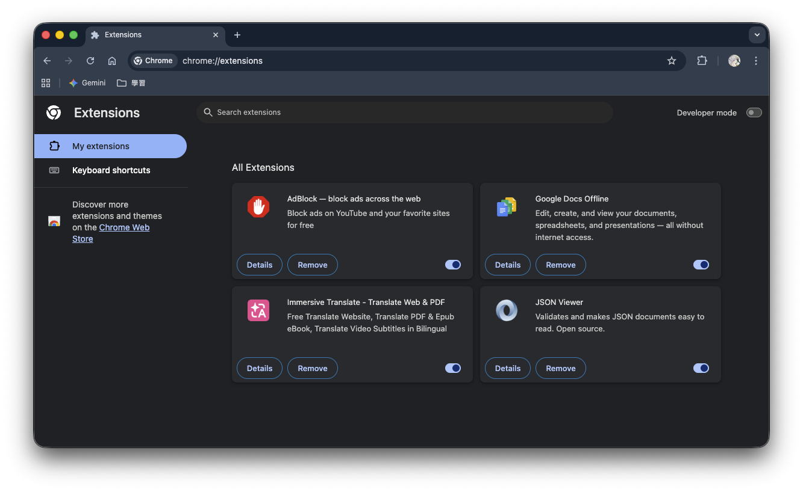

# Download Categorizer

**English** | [繁體中文](README.zh-TW.md)

 

A Chrome extension that automatically categorizes downloaded files into folders based on their file extensions.

 

## Features

- 🚀 **Auto Categorization**: Automatically sorts downloaded files into corresponding folders based on file extension
- 🗂️ **Multiple Categories**: Supports many common formats including music, video, photo, programs, archives, documents, and more
- ⚙️ **Settings Page**: Add, edit, and remove folder mappings, and choose how filename conflicts are handled
- 🔀 **Toggle On/Off**: Enable or disable auto categorization at any time from the popup
- 🔍 **Conflict Detection**: The settings page detects extensions mapped to multiple folders and shows which one takes effect
- 📦 **Import / Export**: Back up or share your configuration as a JSON file, or reset to defaults at any time
- 💾 **Persistent Settings**: Configuration is saved to `chrome.storage.sync` and stays in sync across your browsers
- 🛡️ **Open Source**: Licensed under [GPLv3](LICENSE)

 

## Installation

1. Download or clone this repository
2. Open Chrome and navigate to `chrome://extensions/`
3. Enable **Developer mode** in the top-right corner
4. Click **Load unpacked** and select the project folder

 

## Usage

- Click the extension icon to open the popup, where you can **enable/disable** categorization or open the settings page.
- In the **Settings** page you can:
  - Add, edit, and remove **folder mappings**
  - Choose the **file conflict handling** behavior (Automatically Rename / Overwrite / Ask User)
  - **Import / Export** your settings as JSON, or **reset to default**
  - See **conflict warnings** when an extension is mapped to more than one folder

> When an extension belongs to multiple folders, the **first matching folder (top to bottom)** in the mapping list takes effect.

 

## Category Rules

Category rules are defined in [`src/default.js`](src/default.js). The following types are supported by default:

| Category  | Example Extensions                                                                       |
|-----------|------------------------------------------------------------------------------------------|
| music     | mp3, wav, flac, aac, ogg, m4a, alac, aiff, wma, opus                                      |
| video     | mp4, mkv, avi, mov, wmv, flv, webm, mpeg, mpg, m4v                                        |
| photo     | jpg, jpeg, png, gif, bmp, tiff, heic, heif, raw, cr2, nef, orf, sr2                       |
| image     | img, iso, dmg                                                                             |
| program   | c, cpp, h, hpp, cc, cs, java, py, js, mjs, cjs, ts, rb, go, rs, swift, kt, sql, md, ...   |
| install   | exe, msi, apk, pkg, sh, deb, rpm, bat, run, jar, dpkg, qpkg, bpkg                         |
| document  | pdf, doc, docx, xls, xlsx, ppt, pptx, txt, odt, ods, odp, rtf, tex, csv, log              |
| compress  | zip, rar, 7z, tar, gz, bz2, xz, lz, lzma, zst, tgz, tar.gz, tar.bz2                       |

 

## Development & Contributing

1. Fork and clone this repository
2. Make your changes and submit a Pull Request
3. Feel free to open an issue to report bugs or suggest new features

 

## Related Links

- [GitHub Repository](https://github.com/Zhenyu184/download-categorizer)
- [GPLv3 License](LICENSE)
- [FAQ](docs/faq.md)

 

## Contact

If you have any questions, feel free to leave a comment on [GitHub Issues](https://github.com/Zhenyu184/download-categorizer/issues).
Thank you for using Download Categorizer! 🎉
